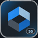

# ColorShift

Personalize seven websites with readable palettes, accessible settings, and site controls.

## Install

Install a userscript manager such as Tampermonkey or Violentmonkey, open the link for your site, and reload the website.

| Image | Site | Link |
| :---: | --- | --- |
|  | ManaPool | [Install ColorShift](https://github.com/ExtraPotions/ColorShift/releases/latest/download/colorshift-manapool.user.js) |
|  | Scryfall | [Install ColorShift](https://github.com/ExtraPotions/ColorShift/releases/latest/download/colorshift-scryfall.user.js) |
|  | SteamGifts | [Install ColorShift](https://github.com/ExtraPotions/ColorShift/releases/latest/download/colorshift-steamgifts.user.js) |
|  | TCGPlayer | [Install ColorShift](https://github.com/ExtraPotions/ColorShift/releases/latest/download/colorshift-tcgplayer.user.js) |
|  | Card Kingdom | [Install ColorShift](https://github.com/ExtraPotions/ColorShift/releases/latest/download/colorshift-cardkingdom.user.js) |
|  | Goodreads | [Install ColorShift](https://github.com/ExtraPotions/ColorShift/releases/latest/download/colorshift-goodreads.user.js) |
|  | Genius | [Install ColorShift](https://github.com/ExtraPotions/ColorShift/releases/latest/download/colorshift-genius.user.js) |

## Controls

Click the ColorShift button or press **Alt+G** to open settings. Press **Escape** or click outside to close. Drag the button vertically to reposition it. The keyboard shortcut is configurable.

Choose from eight palettes and six accents, adjust site options, and use export/import or reset to manage settings. Reduced motion, high contrast, diagnostics, and optional update notices are included. Original mode restores site colours while retaining enabled site options.

## Development

Edit shared behaviour in `src/common.js` and site adapters in `src/sites.js`. Run:

```sh
npm install
npx playwright install chromium
npm run build
npm test
```

Commit the generated `colorshift-*.js` files. Releases use matching `colorshift-VERSION` tags; the release workflow verifies and uploads the scripts, shared helper, and icons.

## Releases

- **0.0.2**: Simplified distribution, settings initialization, and release checks.
- **0.0.1**: Initial ColorShift release for all seven sites.

See [releases](https://github.com/ExtraPotions/ColorShift/releases) for downloads.

## License

[CC BY-NC 4.0](LICENSE) · By [ExtraPotions](https://github.com/ExtraPotions).
