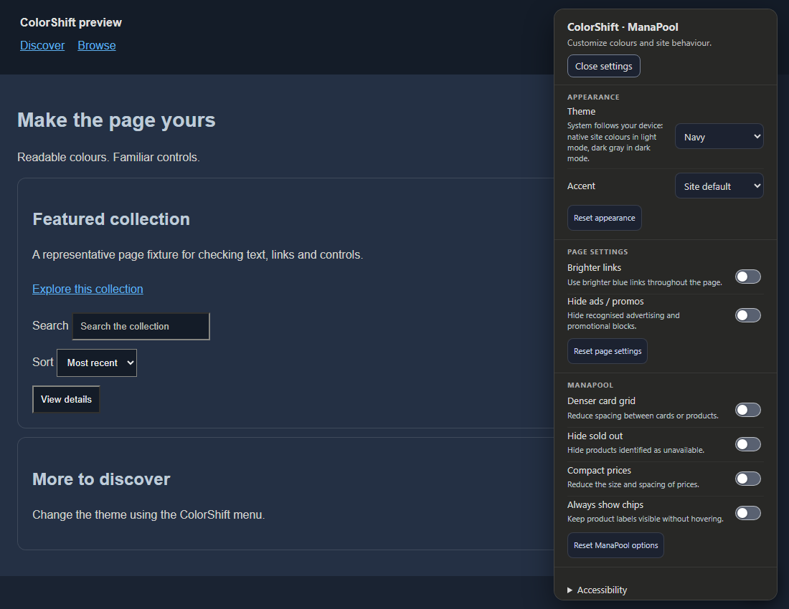
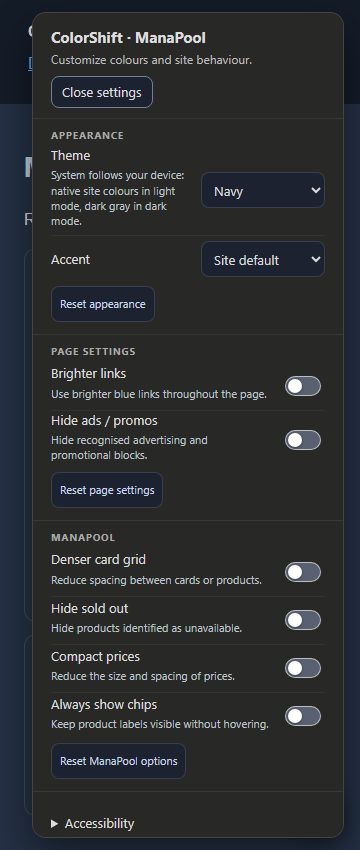

# ColorShift

Personalize seven websites with readable palettes, accessible settings, and site controls.

Current source version: **0.0.3**. See [published releases](https://github.com/ExtraPotions/ColorShift/releases) for available downloads.

## Install

1. Install a userscript manager such as Tampermonkey or Violentmonkey.
2. Open the install link for your site and confirm installation in the manager.
3. Reload the site and click the ColorShift button.

Each userscript includes its code and icon. No separate helper file is needed. Updates are delivered by your userscript manager; optional update notices only announce a newer release.

| Image | Site | Link |
| :---: | --- | --- |
|  | ManaPool | [Install ColorShift](https://github.com/ExtraPotions/ColorShift/releases/latest/download/colorshift-manapool.user.js) |
|  | Scryfall | [Install ColorShift](https://github.com/ExtraPotions/ColorShift/releases/latest/download/colorshift-scryfall.user.js) |
|  | SteamGifts | [Install ColorShift](https://github.com/ExtraPotions/ColorShift/releases/latest/download/colorshift-steamgifts.user.js) |
|  | TCGPlayer | [Install ColorShift](https://github.com/ExtraPotions/ColorShift/releases/latest/download/colorshift-tcgplayer.user.js) |
|  | Card Kingdom | [Install ColorShift](https://github.com/ExtraPotions/ColorShift/releases/latest/download/colorshift-cardkingdom.user.js) |
|  | Goodreads | [Install ColorShift](https://github.com/ExtraPotions/ColorShift/releases/latest/download/colorshift-goodreads.user.js) |
|  | Genius | [Install ColorShift](https://github.com/ExtraPotions/ColorShift/releases/latest/download/colorshift-genius.user.js) |

## Preview

Representative page fixtures, shown with the ColorShift menu.





## Controls

Click the ColorShift button or press **Alt+G** to open settings. Press **Escape** or click outside to close. Drag the button vertically to reposition it. The keyboard shortcut is configurable.

Choose a palette and accent, or select **System** to follow your device: native site colours in light mode and dark gray in dark mode. Adjust site options and use export/import to transfer settings. Each section has its own reset, which leaves other sections unchanged. Reduced motion, high contrast, diagnostics, and optional update notices are included. Original mode restores site colours while retaining enabled site options.

## Development

Edit shared behaviour in `src/common.js` and site adapters in `src/sites.js`. Run:

```sh
npm ci
npx playwright install chromium
npm run build
npm test
npm run release:check
```

Edit `src/common.js` and `package.json` together when changing the version. Update this README and `CHANGELOG.md`, run `npm install --package-lock-only`, then rebuild. Commit the seven generated `colorshift-*.user.js` files.

`npm test` covers standalone startup, settings upgrades from 0.0.2, export/import, update failures, palette contrast, desktop/mobile screenshot restoration, system theme changes, section resets, and large-page updates. `npm run build:check` detects stale bundles without rewriting them.

For live site checks, run `npm run test:live`. Site challenges and incomplete page loads are reported separately; fixture tests do not establish complete live-site coverage.

Publish from a matching `colorshift-VERSION` tag. The release workflow checks package, runtime, lockfile, README, changelog, and userscript versions and runs the full suite before uploading assets. Preview screenshots are generated by `tests/visual.cjs` in `test-results/visual/`.

## Releases

Read the [changelog](CHANGELOG.md) for changes and [releases](https://github.com/ExtraPotions/ColorShift/releases) for downloads.

## License

[CC BY-NC 4.0](LICENSE) · By [ExtraPotions](https://github.com/ExtraPotions).
